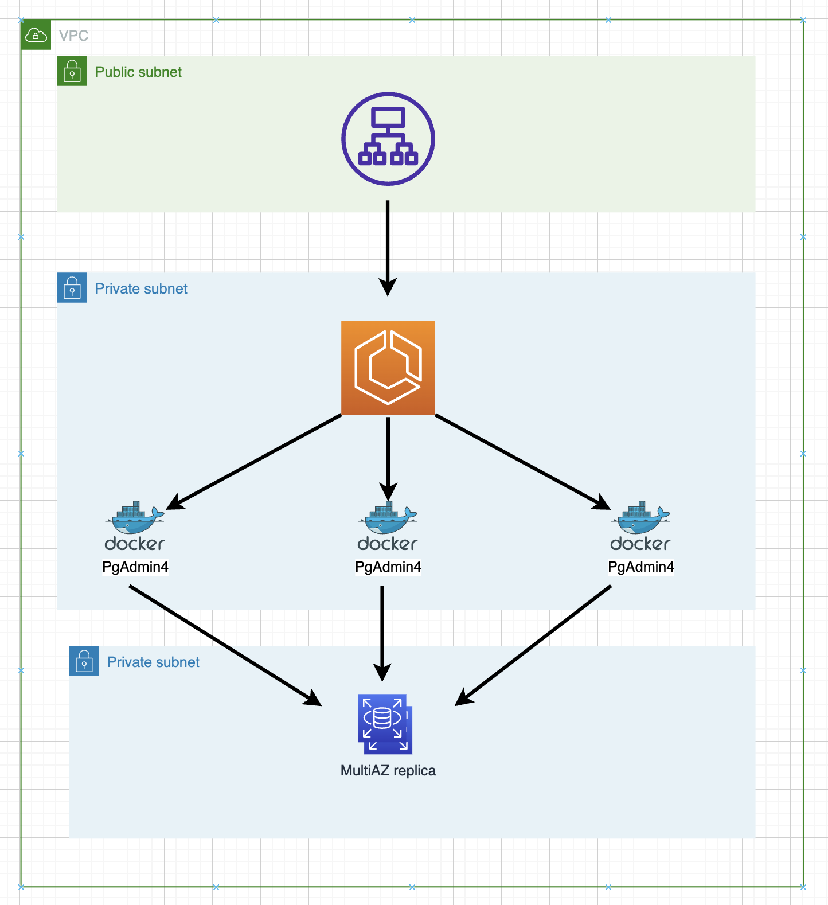

# Content

### - Architecture overview
### - Prerequisites
### - How to use cdktf stack

# Architecture overview



# Prerequisites

In order to the build process, you have to have these tools installed:

1. AWS CLI (with at least default profile configured)
2. git
3. Terraform
4. nodejs
5. cdktf
6. Docker

*(I'll skip aws cli and git as a most obvious ones)*

## Install Terraform
*For that example, I used Amazon Linux, but for other os, find instructions here*
https://learn.hashicorp.com/tutorials/terraform/install-cli
```
sudo yum install -y yum-utils
```
```
sudo yum-config-manager --add-repo https://rpm.releases.hashicorp.com/AmazonLinux/hashicorp.repo
```
```
sudo yum -y install terraform
```

## Install nodejs

```
curl -o- https://raw.githubusercontent.com/nvm-sh/nvm/v0.34.0/install.sh | bash
```
```
. ~/.nvm/nvm.sh
```
```
nvm install node
```
```
node -e "console.log('Running Node.js ' + process.version)"
```

## Install cdktf

```
npm install --global cdktf-cli@latest
```

## Install Docker

```
sudo yum install docker -y
```
```
sudo systemctl start docker.service
```


# How to use cdktf stack

## Initiate the build

Note - main code entrypoint is **main.ts**

Check with Prerequisites section, if everything is in order, run the following script:
```
./startScript.sh
```
then - select **Approve**

As outputs you'll get next details:
- ALB endpoint
- pgAdmin username
- pgAdmin password

## Destroy the stack
To destroy the stack, run the following command:
```
npm run destroy
```
