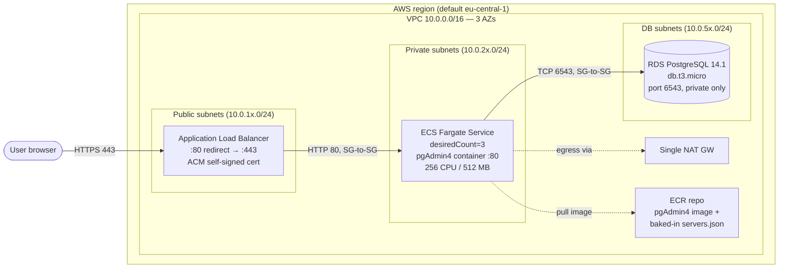

# pgadmin-aws

One-command deployment of a private, browser-based PostgreSQL admin UI on AWS — pgAdmin4 on ECS Fargate, fronted by an HTTPS ALB, with RDS PostgreSQL kept entirely off the public internet.

Authored in **TypeScript** using **CDK for Terraform (cdktf)**. Synthesises to Terraform JSON; deploys via the AWS provider.

---

## Why this exists

Teams running RDS for PostgreSQL routinely need a SQL GUI for admins, analysts, and on-call engineers. The lazy options are bad:

- Expose RDS publicly — leaks the database to the internet.
- Run pgAdmin on a bastion / laptop — credentials sprawl, no central audit.
- SSH tunnels — works, but doesn't scale to a team and breaks for non-engineers.

This stack puts pgAdmin **inside the VPC**, gives it a public HTTPS endpoint via an ALB, and wires the RDS security group so the database accepts traffic **only from the pgAdmin tasks**. The DB never gets a public IP, never gets a `0.0.0.0/0` ingress rule.

---

## 📦 Architecture


```mermaid
flowchart LR
    user([User browser])
    subgraph AWS["AWS region (default eu-central-1)"]
        subgraph VPC["VPC 10.0.0.0/16 — 3 AZs"]
            subgraph PUB["Public subnets (10.0.1x.0/24)"]
                ALB["Application Load Balancer<br/>:80 redirect → :443<br/>ACM self-signed cert"]
            end
            subgraph PRIV["Private subnets (10.0.2x.0/24)"]
                ECS["ECS Fargate Service<br/>desiredCount=3<br/>pgAdmin4 container :80<br/>256 CPU / 512 MB"]
            end
            subgraph DB["DB subnets (10.0.5x.0/24)"]
                RDS[("RDS PostgreSQL 14.1<br/>db.t3.micro<br/>port 6543, private only")]
            end
            NAT["Single NAT GW"]
            ECR["ECR repo<br/>pgAdmin4 image +<br/>baked-in servers.json"]
        end
    end

    user -->|HTTPS 443| ALB
    ALB -->|HTTP 80, SG-to-SG| ECS
    ECS -->|TCP 6543, SG-to-SG| RDS
    ECS -.pull image.-> ECR
    ECS -.egress via.-> NAT
```

**Traffic flow:** user → ALB (`:443`, self-signed cert) → ECS task (`:80`, private subnet) → RDS (`:6543`, DB subnet). Each hop is locked by a dedicated Security Group whose ingress references the *previous* hop's SG by ID — no CIDR-based shortcuts.

---

## Key design decisions

| Decision | Rationale |
|---|---|
| **ECS Fargate, not Lambda** | pgAdmin4 is a stateful Flask app with a local SQLite session store. It expects to live behind a sticky-session load balancer, not a 15-min request/response runtime. |
| **ALB sticky sessions (`lb_cookie`)** | pgAdmin stores auth state per-instance; without stickiness, the 3-task fleet would log users out on every request. |
| **3 tasks across 3 AZs** | Multi-AZ availability for the admin UI; AZ failure doesn't kill DB access for on-call. |
| **Non-standard DB port `6543`** | Defence-in-depth. Drive-by port scanners hit 5432 first. Doesn't replace SG controls, just reduces noise. |
| **SG-to-SG references everywhere** | Database SG ingress is `securityGroups: [pgadminSecurityGroup.id]`, not a CIDR. Tasks can't be spoofed by anything else in the VPC. |
| **Image baked with `servers.json` + `pgpassfile`** | Users land on a pre-configured server connection. No manual setup, no secrets typed into the UI. Files are written by the `local` provider and the task waits on them via `dependsOn`. |
| **Single NAT Gateway** | Cost optimisation for a dev/demo stack (~$32/mo per NAT). Production fork should use one-per-AZ. |
| **Separate ECS execution role vs task role** | Execution role gets `ecr:*` + `logs:*` to pull the image and bootstrap; task role only gets `logs:*` at runtime. Least-privilege split. |
| **`Sleep` resource after ECS service** | Terraform considers the ALB "ready" before target-group health checks pass — first user request would hit a 502. The 3-minute sleep gates the stack output on real readiness. |

---

## AWS services used

- **VPC** — 3 public + 3 private + 3 database subnets across 3 AZs, IGW, single NAT GW
- **ECS** on **Fargate** — cluster, service (desired count 3), task definition (256 CPU / 512 MB)
- **ECR** — private repo; image built and pushed by a `null_resource` local-exec at deploy time
- **Application Load Balancer** — HTTP→HTTPS redirect, HTTPS listener with path-based rule, IP target group
- **ACM** — imports a TLS-provider-generated self-signed cert (replace with a real cert for production)
- **RDS** — PostgreSQL 14.1, `db.t3.micro`, 5 GB, private DB subnet group
- **IAM** — separate execution and task roles, inline least-privilege policies
- **CloudWatch Logs** — `awslogs` driver, 30-day retention, group `cluster/pgadmin`
- **Secrets** — DB username, DB password, and pgAdmin admin password generated via the `random` provider; surfaced as Terraform outputs

---

## Prerequisites

- AWS CLI configured (default profile or `AWSPROFILE` env var)
- Node.js >= 14
- Terraform CLI
- `cdktf-cli` (`npm i -g cdktf-cli`)
- Docker (the deploy builds & pushes the pgAdmin image to ECR locally — `sudo docker` must work without a password prompt)

---

## Deploy

```bash
git clone https://github.com/vaspoz/pgadmin-aws.git
cd pgadmin-aws
./startScript.sh
# prompts: AWS region (default eu-central-1), AWS profile (default "default")
# then: select "Approve" at the Terraform plan
```

Outputs at the end of `cdktf deploy`:

- `AlbUrl` — paste into the browser (accept the self-signed cert warning)
- `pgadminuser` — `default@email.eu`
- `pgadminpass` — 16-char generated password

Log in; the `postgresql` server is already configured under **Servers** — just click and connect.

## Destroy

```bash
./destroyScript.sh
```

`skipFinalSnapshot: true` is set on RDS, so teardown is clean and immediate. Adjust before using with real data.

---

## 💰 Rough monthly cost (eu-central-1, on-demand)

| Resource | Notes | ~USD/month |
|---|---|---|
| ALB | 1 instance, low traffic | ~$18 |
| NAT Gateway | single, ~$0.045/hr + data | ~$32 |
| Fargate | 3 × (0.25 vCPU + 0.5 GB), 24/7 | ~$22 |
| RDS `db.t3.micro` | single-AZ, 5 GB gp2 | ~$14 |
| ECR + CW Logs + data | small | ~$2 |
| **Total** | | **~$85–90** |

For a personal sandbox, drop `desiredCount` to 1 and scale the stack down outside work hours — easily under $50.

---

## Security notes & honest limitations

This is a **reference / learning stack**, not a production drop-in. Before putting it in front of real data:

- **Self-signed ACM cert** — fine for a demo, browsers will warn. Swap for a real cert (Route 53 + ACM DNS validation).
- **pgAdmin default email is hardcoded** (`default@email.eu`). Parameterise it.
- **Generated passwords are Terraform outputs**, not stored in Secrets Manager. Moving them to AWS Secrets Manager with rotation is the obvious next step.
- **Image build runs `sudo docker` locally** via a `null_resource` provisioner — convenient for one-person stacks, but for CI/CD this should move to CodeBuild or a GitHub Actions runner with OIDC.
- **No WAF in front of the ALB.** Add `AWSManagedRulesCommonRuleSet` if exposing publicly.
- **Single NAT Gateway** is a single point of failure for egress; production should be one-per-AZ.

---

## Repo layout

```
main.ts                          # Stack entrypoint — composes the 4 constructs
infra_resources/
├── providers.ts                 # aws, null, random, local, tls, time
├── main_vpc.ts                  # VPC with 9 subnets + NAT
├── psql_db.ts                   # RDS + generated creds + servers.json/pgpassfile
├── pgadmin_alb.ts               # ALB, listeners, target group, ECS service, SGs
└── ecs/
    ├── ecs_cluster.ts           # Cluster, task definition, IAM roles, log group
    ├── ecr_image.ts             # ECR repo + local docker build/push
    └── Dockerfile               # FROM dpage/pgadmin4, bakes servers.json
```

## Status

Working reference implementation. Pinned to `cdktf 0.10` / AWS provider `~> 3.0` — versions are a snapshot of when this was built. PRs welcome.
